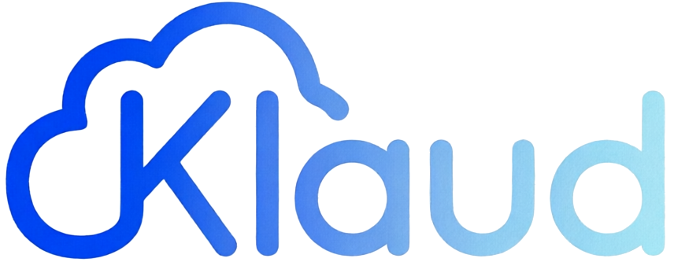

<div align="center">
  
</div>

**Kol** is a local-first Android call agent.

It turns a dedicated Android phone into an always-on receptionist that can answer calls,
understand intent, respond with natural voice, and complete simple call workflows fully
on-device.

No cloud inference. No remote speech backend. No account required.

---

## Features

- Fully on-device voice loop (STT -> LLM -> TTS)
- Hands-free conversational responses for inbound calls
- Local-first privacy model (audio and transcripts stay on device)
- Single LLM target for alpha: Gemma 4 E2B
- On-device speech recognition via whisper.cpp
- Whisper multilingual model ladder: small (default), medium, large-v3
- Language-selectable TTS target set: German, English, Spanish, Chinese
- On-device speech synthesis via Sherpa-ONNX / Piper stack
- Offline-capable operation after model setup
- Android-native app architecture (no Electron/web wrapper)

## Alpha Scope (Locked)

Kol alpha intentionally keeps only the minimum runtime surface:

- Active tasks: `LLM Chat` and `Whisper`
- LLM allowlist: `Gemma-4-E2B-it` only
- Whisper allowlist: multilingual `small`, `medium`, `large-v3`
- Everything else is being removed or left disabled for now

---

## What Kol Is For

- Small business call reception
- After-hours answering
- Appointment and callback intake
- Basic caller triage and escalation

Kol is designed for a dedicated device that stays plugged in and runs continuously.

---

## Privacy Model

1. Speech processing runs locally on the device
2. Language inference runs locally on the device
3. Voice generation runs locally on the device
4. No mandatory cloud roundtrip for call handling

Network access may still be used for optional model downloads and update checks.

---

## Runtime Stack

- Upstream foundation: Google AI Edge Gallery (via Box fork lineage)
- LLM runtime: llama.cpp (GGUF)
- Speech-to-text: whisper.cpp
- Text-to-speech: Sherpa-ONNX / Piper
- Platform: Android (Kotlin + native modules)

---

## Requirements

- Android Studio (latest stable)
- Android SDK installed
- NDK side-by-side (project auto-installs required version on first build)
- Physical Android device recommended for realistic testing

---

## Build (Debug)

```bash
git clone --recurse-submodules <your-kol-repo-url>
cd Kol/Android/src
```

Create `local.properties` if needed:

```properties
sdk.dir=/Users/<your-user>/Library/Android/sdk
```

Build:

```bash
./gradlew :app:assembleDebug
```

Install from Android Studio or via `adb` using the generated debug APK.

---

## Current Status

Early alpha. Core direction and local runtime foundation are in place; product behavior,
call workflow logic, and UX are still being iterated.

---

## License

Apache 2.0 — see [LICENSE](LICENSE)
